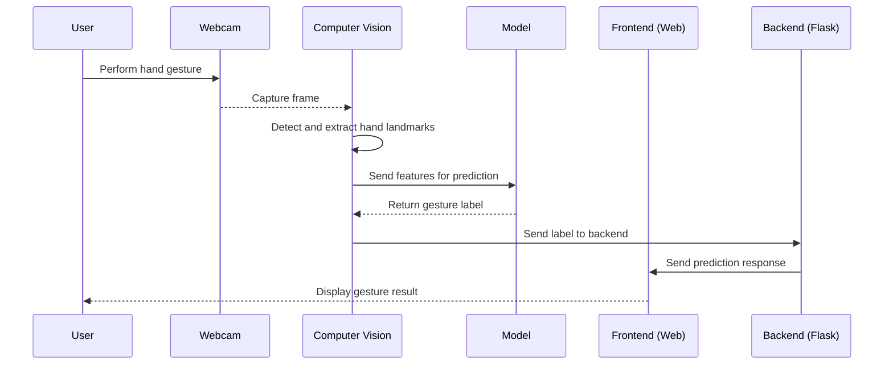
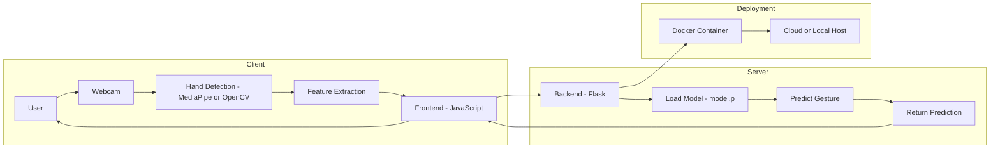

# 🤚 HandWave – Real-Time Hand Gesture Recognition

**HandWave** is a computer vision and machine learning project that allows you to control actions using hand gestures captured through a webcam. It’s lightweight, simple, and containerized for easy deployment.

<table>
<tr>
<td width="50%">

### 🚀 Features

- 🎥 Real-time gesture recognition  
- 🧠 Custom-trained model  
- 📦 Dockerized deployment  
- 🗂️ Data collection & testing scripts  

</td>
<td width="50%">

### 🧰 Tech Stack

- Python  
- OpenCV  
- Mediapipe  
- scikit-learn  
- Docker  

</td>
</tr>
</table>


## Control Flow 



---


## 🏗️ Architecture Diagram



---


## 🛠️ Setup Instructions

### 1. Clone the Repository

```bash
git clone https://github.com/your-username/HandWave.git
cd HandWave
```
### Install Dependencies (Without Docker)
Create and activate a virtual environment (recommended)
```bash
python -m venv venv
source venv/bin/activate  # On Windows: venv\Scripts\activate
```

### Install required packages

```bash
pip install -r requirements.txt
cd webapp
pip install -r requirements.txt
```

### 3. Collect Hand Gesture Data

```bash
python collecting_data.py
```

### 4. Process Data

```bash
processing_data.py
```
### 5. Train the Model

```bash
python model_train.py
```
### 6. Run the Web App
```bash
cd webapp

python app.py
```

Then open your browser and visit:

```bash
http://localhost:5000
```

## 🐳 Docker Setup (Optional)

### Build Docker Image

```bash
docker build -t handwave .
```

### Run Docker Container

```bash
docker run -p 5000:5000 handwave
```
```bash
Access the app at: http://localhost:5000
```
## 📄 License

This project is licensed under the MIT License.

## 🙌 Contributions

Feel free to open issues or submit pull requests to improve this project!

