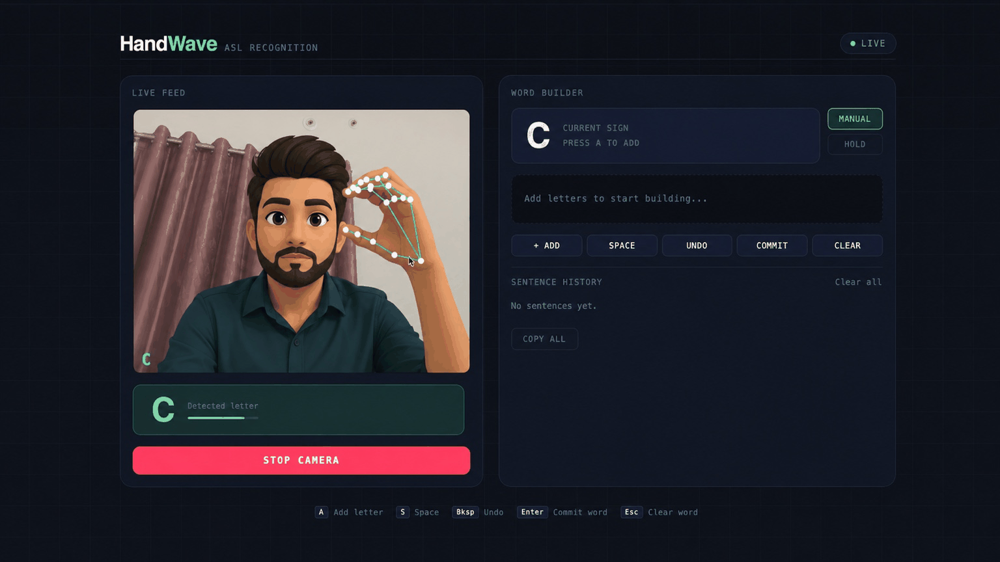
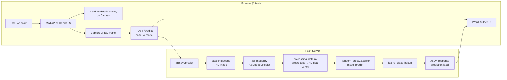
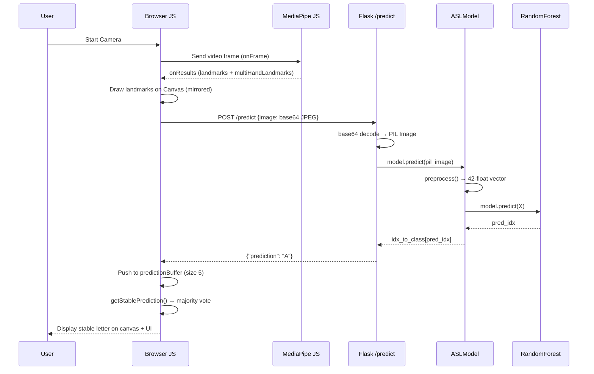
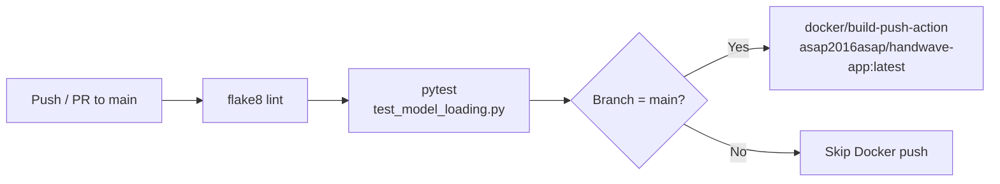

# HandWave – Real-Time ASL Gesture Recognition

[](https://github.com/AnupamKumar-1/HandWave/actions/workflows/ci.yml)

**HandWave** is a real-time American Sign Language (ASL) recognition web application. It uses MediaPipe for hand landmark extraction, a scikit-learn RandomForest classifier for gesture classification, and a Flask backend to serve predictions to a browser-based frontend. The full pipeline — from data collection to model training to live inference — is self-contained and Dockerized.

---

## Demo



---

## Project Structure

```
.
├── .github
│   └── workflows
│       └── ci.yml
├── Dockerfile
├── LICENSE
├── README.md
├── collecting_data.py
├── data.pickle
├── label_map.pickle
├── model.p
├── model_test.py
├── model_train.py
├── processing_data.py
├── pytest.ini
├── requirements.txt
├── src
│   └── handwave_asl.gif
├── tests
│   ├── conftest.py
│   └── test_model_loading.py
└── webapp
    ├── app.py
    ├── asl_model.py
    ├── static
    │   ├── css
    │   │   └── style.css
    │   └── js
    │       └── app.js
    └── templates
        └── index.html
```

---

## Tech Stack

| Layer | Technology |
|---|---|
| Hand landmark detection | MediaPipe Hands (Python + JS) |
| Feature extraction | OpenCV, MediaPipe (`processing_data.py`) |
| ML model | scikit-learn `RandomForestClassifier` |
| Backend | Flask + Gunicorn |
| Frontend | Vanilla JS, HTML5 Canvas, MediaPipe JS SDK |
| Containerization | Docker (`python:3.10-slim`) |
| CI/CD | GitHub Actions (lint → test → Docker Hub push) |

---

## Features

- Real-time webcam feed with hand landmark overlay (MediaPipe JS)
- Server-side ASL letter prediction via `/predict` POST endpoint
- Word builder with Manual and Hold input modes
- Sentence history with per-word copy and copy-all support
- Keyboard shortcuts (`A`, `S`, `Backspace`, `Enter`, `Esc`)
- Dockerized — single image, no local setup required
- CI/CD pipeline: lint (flake8) → test (pytest) → push to Docker Hub on `main`

---

## Architecture


```mermaid
graph LR
  subgraph Browser["Browser (Client)"]
    A[User webcam] --> B[MediaPipe Hands JS]
    B --> C[Hand landmark overlay\non Canvas]
    B --> D[Capture JPEG frame]
    D --> E[POST /predict\nbase64 image]
    E --> P[Word Builder UI]
  end

  subgraph Server["Flask Server"]
    F[app.py /predict] --> G[base64 decode\nPIL Image]
    G --> H[asl_model.py\nASLModel.predict]
    H --> I[processing_data.py\npreprocess → 42-float vector]
    I --> J[RandomForestClassifier\nmodel.predict]
    J --> K[idx_to_class lookup]
    K --> L[JSON response\nprediction label]
  end

  E --> F
  L --> P
```

---

## Request Lifecycle


```mermaid
sequenceDiagram
  participant U as User
  participant JS as Browser JS
  participant MP as MediaPipe JS
  participant Flask as Flask /predict
  participant ASL as ASLModel
  participant RF as RandomForest

  U->>JS: Start Camera
  JS->>MP: Send video frame (onFrame)
  MP-->>JS: onResults (landmarks + multiHandLandmarks)
  JS->>JS: Draw landmarks on Canvas (mirrored)
  JS->>Flask: POST /predict {image: base64 JPEG}
  Flask->>Flask: base64 decode → PIL Image
  Flask->>ASL: model.predict(pil_image)
  ASL->>ASL: preprocess() → 42-float vector
  ASL->>RF: model.predict(X)
  RF-->>ASL: pred_idx
  ASL-->>Flask: idx_to_class[pred_idx]
  Flask-->>JS: {"prediction": "A"}
  JS->>JS: Push to predictionBuffer (size 5)
  JS->>JS: getStablePrediction() → majority vote
  JS-->>U: Display stable letter on canvas + UI
```

---

## ML Pipeline

```mermaid
flowchart TD
  A[collecting_data.py\nWebcam → JPEG images per label] --> B[processing_data.py\nMediaPipe → 42-float vectors\ndata.pickle + label_map.pickle]
  B --> C[model_train.py\nRandomForestClassifier\nn_estimators=100]
  C --> D[model.p + label_map.pickle\nmodel serialized separately from label map]
  D --> E[webapp/asl_model.py\nASLModel wraps classifier]
  E --> F[/predict endpoint\nreal-time inference]
```

**Feature vector:** 21 hand landmarks × 2 (x, y) = **42 floats**, normalized by subtracting the minimum x and y of the detected hand so the vector is position-invariant.

**Artifact formats:**
- `model_train.py` saves `model.p` as `{"model": ..., "label_map": ...}` (both bundled).
- `webapp/asl_model.py`'s `load_model()` loads the classifier from `model.p` and the label map from the **separate** `label_map.pickle` file. Any label map embedded inside `model.p` is ignored by the web app.
- `model_test.py`'s `load_model()` first tries the label map embedded in `model.p`, then falls back to a standalone `label_map.pickle` if none is found there.

**Label map format:** `label_map.pickle` stores `{class_name: index}` (e.g. `{"A": 0, "B": 1, ...}`). `ASLModel` inverts this to `idx_to_class` for decoding predictions.

---

## CI/CD Pipeline


```mermaid
flowchart LR
  PR[Push / PR to main] --> L[flake8 lint]
  L --> T[pytest\ntest_model_loading.py]
  T --> B{Branch = main?}
  B -- Yes --> D[docker/build-push-action\nasap2016asap/handwave-app:latest]
  B -- No --> Skip[Skip Docker push]
```

Secrets required in GitHub repository settings:

| Secret | Purpose |
|---|---|
| `DOCKER_USERNAME` | Docker Hub username |
| `DOCKER_PASSWORD` | Docker Hub password / access token |

---

## Setup

### Without Docker

```bash
git clone https://github.com/AnupamKumar-1/HandWave.git
cd HandWave

python -m venv venv
source venv/bin/activate        # Windows: venv\Scripts\activate

pip install -r requirements.txt
```

### 1. Collect training images

```bash
python collecting_data.py
# Enter labels when prompted, e.g.: A,B,C,space,del
# Press Q to start recording each label (100 images per label)
```

Images are saved to `./data/<label>/`.

### 2. Extract landmarks and build dataset

```bash
python processing_data.py
# Outputs: data.pickle, label_map.pickle
```

### 3. Train the model

```bash
python model_train.py
# Outputs: model.p  (contains {"model": ...} with the RandomForest classifier)
#          label_map.pickle is read as input and must already exist
# Displays confusion matrix and classification report
```

### 4. (Optional) Test inference locally via webcam

```bash
python model_test.py
# Press Esc to quit
```

### 5. Run the web app

```bash
cd webapp
python app.py
# Listening on http://localhost:5000
```

---

## Docker

### Build

```bash
docker build -t handwave .
```

> **Note:** `model.p` and `label_map.pickle` must exist at the project root before building the image, as they are copied in via `COPY . .`.

### Run

```bash
docker run -e PORT=5000 -p 5000:5000 handwave
```

Open `http://localhost:5000`.

The container uses `gunicorn` as the WSGI server (`webapp.app:app`) and **requires** the `PORT` environment variable to be set — there is no default inside the container since gunicorn bypasses the `app.py` `__main__` block entirely.

```bash
docker run -e PORT=8080 -p 8080:8080 handwave
```

---

## API

### `GET /`
Serves `index.html` (the main UI).

### `POST /predict`

**Request body (JSON):**
```json
{ "image": "data:image/jpeg;base64,<base64-encoded frame>" }
```

**Response (JSON):**
```json
{ "prediction": "A" }
```

On error:
```json
{ "error": "<error message>" }
```

The endpoint strips the `data:image/...;base64,` prefix, decodes to a PIL image, runs `ASLModel.predict()` (MediaPipe preprocessing → RandomForest), and returns the predicted ASL letter.

---

## Tests

```bash
pytest --maxfail=1 --disable-warnings -q
```

Tests live in `tests/test_model_loading.py` and cover:

- `load_label_map` loads and returns the correct dict from a pickle file
- `load_model` returns an `ASLModel` instance with a `model` attribute
- Model file existence check

`conftest.py` adds the project root to `sys.path` so `webapp.*` imports resolve correctly.

---

## Keyboard Shortcuts

| Key | Action |
|---|---|
| `A` | Add current detected letter to word |
| `S` | Add space |
| `Backspace` | Undo last character |
| `Enter` | Commit word to sentence history |
| `Esc` | Clear current word |

---

## License

This project is licensed under the MIT License.

## Contributions

Feel free to open issues or submit pull requests!